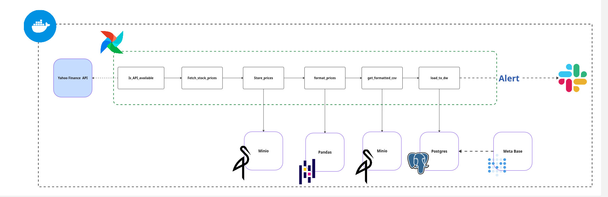

#  Stock Market Data Pipeline

A production-grade batch data pipeline that extracts stock price data from Yahoo Finance, transforms it using pandas, stores it in a MinIO data lake, loads it into a PostgreSQL data warehouse, and visualizes it through a Metabase dashboard — all orchestrated by Apache Airflow running on Astro CLI.

---

## Architecture



```
Yahoo Finance API
      │
      ▼
┌─────────────────┐
│ is_api_available│  ← Airflow Sensor (poke every 60s)
└────────┬────────┘
         │
         ▼
┌─────────────────┐
│fetch_stock_prices│  ← Extract raw OHLCV data
└────────┬────────┘
         │
         ▼
┌─────────────────┐
│  store_prices   │  ← Store raw JSON → MinIO (Bronze)
└────────┬────────┘
         │  stock-data/{symbol}/prices_data.json
         ▼
┌─────────────────┐
│format_stock_data│  ← Transform with pandas → CSV → MinIO (Silver)
└────────┬────────┘
         │  stock-data/{symbol}/prices_formatted.csv
         ▼
┌─────────────────┐
│get_formatted_csv│  ← Validate file exists in MinIO
└────────┬────────┘
         │
         ▼
┌─────────────────┐
│   load_to_dw    │  ← Batch load → PostgreSQL
└────────┬────────┘
         │
         ▼                        ▼
┌─────────────────┐      ┌─────────────────┐
│    Metabase     │      │      Slack       │
│   Dashboard     │      │  Pipeline Alert  │
└─────────────────┘      └─────────────────┘
```

---

## Tech Stack

| Layer | Technology | Purpose |
|---|---|---|
| Orchestration | Apache Airflow 3 + Astro CLI | DAG scheduling & task management |
| Source | Yahoo Finance API | stock price data |
| Storage | MinIO | S3-compatible data lake |
| Transform | Pandas | Data cleaning & formatting |
| Warehouse | PostgreSQL | Analytical data store |
| Visualization | Metabase | Business intelligence dashboard |
| Alerting | Slack | Pipeline success & failure notifications |
| Infrastructure | Docker + Astro CLI | Containerized local environment |

---

## Project Structure

```
├── dags/
│   └── stock_market.py          # DAG definition — orchestration only
├── include/
│   ├── helpers/
│   │   └── minio.py             # Shared MinIO client (DRY helper)
│   └── stock/
│       ├── extract.py           # fetch_stock_data()
│       ├── store.py             # store_stock_data()
│       ├── format.py            # format_stock_data()
│       ├── getformatted.py      # get_formatted_csv()
│       └── load.py              # load_to_dw()
├── tests/                       # Unit tests
├── docs/
│   ├── architecture.png         # Pipeline architecture diagram
│   ├── dashboard.png            # Metabase dashboard screenshot        
│   └── dashboard.sql            # These are the SQL commands used within Metabase
├── Dockerfile
├── docker-compose.override.yml
├── requirements.txt
├── packages.txt
└── .env
```

---


## Getting Started

### Prerequisites

- [Astro CLI](https://docs.astronomer.io/astro/cli/install-cli)
- Docker Desktop

### Installation

```bash
# Clone the repository
git clone https://github.com/Mo-Taha-295/stock-market-pipeline
cd stock-market-pipeline

# Start the Astro environment
astro dev start
```

Access the services:

| Service | URL | Credentials |
|---|---|---|
| Airflow UI | http://localhost:8080 | admin / admin |
| MinIO Console | http://localhost:9001 | minio / minio123 |
| Metabase | http://localhost:3000 | set on first run |

---

## Airflow Connections

Set up the following connections in Airflow UI → Admin → Connections:

### `stock_api`
```
Connection Type: HTTP
Host:            https://query1.finance.yahoo.com
Extra JSON:
{
    "endpoint": "/v8/finance/chart/",
    "headers": {"User-Agent": "Mozilla/5.0"}
}
```

### `minio_conn`
```
Connection Type: Amazon Web Services
Login:            <minio>
Password:        <minio123>
Extra JSON:
{
    "endpoint_url": "http://minio:9000"
}
```

### `postgres_conn`
```
Connection Type: Postgres
Host:            postgres
Login:           postgres
Password:        postgres
Port:            5432
Database:        postgres
```

### `slack_conn`
```
Connection Type: Slack API Token
You must have a Slack account to generate your OAuth token          
```

---

## Dashboard

The Metabase dashboard connects directly to PostgreSQL and includes:

- **Close Price Over Time** — daily closing price line chart
- **Daily Trading Volume** — volume bar chart per day
- **Daily Return %** — gain/loss percentage per day
- **7-Day Moving Average** — smoothed price trend line

---

## Data Schema

```sql
CREATE TABLE public.stock_prices_dw (
    timestamp   TIMESTAMP NOT NULL PRIMARY KEY,
    open        NUMERIC,
    high        NUMERIC,
    low         NUMERIC,
    close       NUMERIC,
    volume      BIGINT
);
```

---

## Dependencies

```txt
# requirements.txt
astro-sdk-python[amazon,postgres]==1.8.1
apache-airflow-providers-amazon>=8.0.0
apache-airflow-providers-postgres>=5.0.0
apache-airflow-providers-http>=4.0.0
apache-airflow-providers-slack>=8.0.0
requests>=2.31.0
minio>=7.0.0
```

```txt
# packages.txt
libpq-dev
g++
```

---

## Key Concepts Applied

- **Sensor pattern** — poll API availability before extracting
- **Idempotent loads** — safe to rerun without duplicate data
- **Single transaction** — all DB operations commit or rollback together
- **Batch loading** — staging table pattern for conflict-free bulk inserts
- **DRY principle** — shared MinIO client in `include/helpers/`
- **Separation of concerns** — thin DAG, logic in `include/`
- **Fail loudly** — raise exceptions, never swallow errors silently

---

## Author

**Mohamed T Elsayed** — Data Engineer 
---

## 📄 License

MIT License
